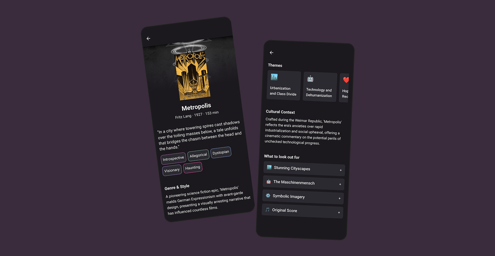

# Prelude

An AI‑assisted film companion built with Expo. Search movies, view rich context, and get a thoughtful, spoiler‑free guide powered by OpenAI.




## ✨ Features

- Film search (OMDb)
- Rich metadata (TMDB) for posters and details
- AI Film Guide (OpenAI):
- Recently viewed list (local)
- Settings screen to manage API keys
- Modern mobile UI with NativeWind and animations (Moti)

## 🛠️ Tech Stack

- Expo (React Native) + TypeScript, Expo Router, React Navigation
- NativeWind (Tailwind CSS), Moti
- AsyncStorage for local persistence
- Axios for networking
- OpenAI API, OMDb API, TMDB API

## 🚀 Getting Started

### Prerequisites
- Node.js 18+
- npm or yarn
- Expo Go app (for device testing) or Android/iOS simulators

### Install

```bash
npm install
```

### Configure API Keys
You can provide keys in two ways. The in‑app Settings screen is the simplest.

1) In‑app (recommended for development)
- Open the app → Settings (gear icon) → paste keys:
  - OpenAI API Key
  - OMDb API Key
  - TMDB Read Access Token (Bearer token)

2) Environment variables (read at runtime)
- Set these before starting the app (EXPO_PUBLIC_* are intentionally public in client bundles):

```bash
export EXPO_PUBLIC_OPENAI_API_KEY=your_openai_key
export EXPO_PUBLIC_OMDB_API_KEY=your_omdb_key
export EXPO_PUBLIC_TMDB_READ_ACCESS_TOKEN=your_tmdb_bearer_token
```

### Run

```bash
npx expo start
```

Shortcuts:
- Android: `npm run android`
- iOS: `npm run ios`
- Web: `npm run web`
